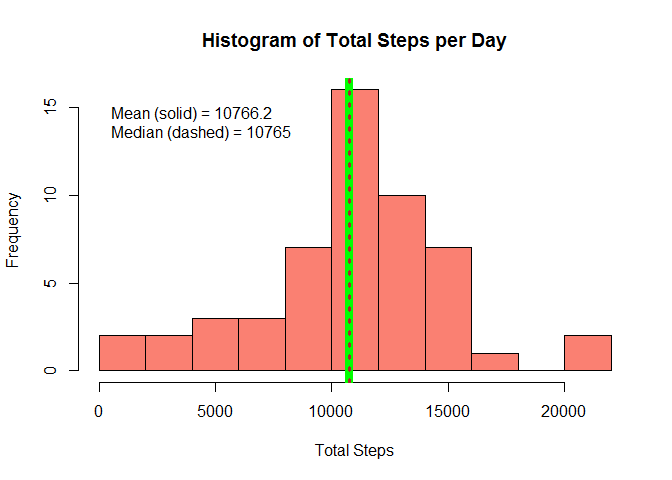
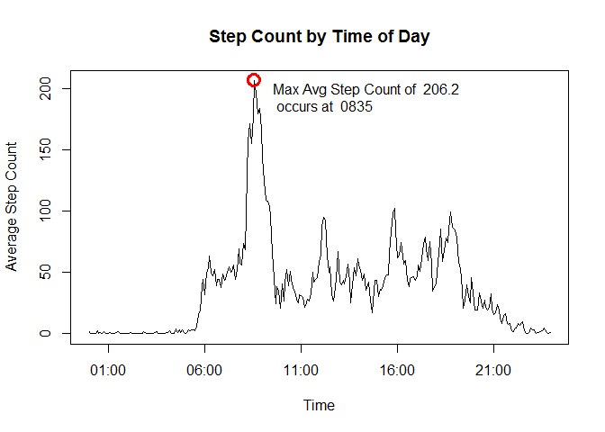
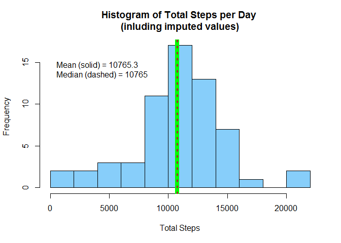
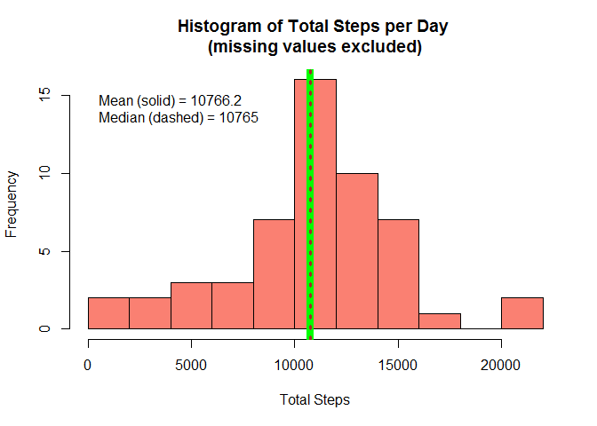
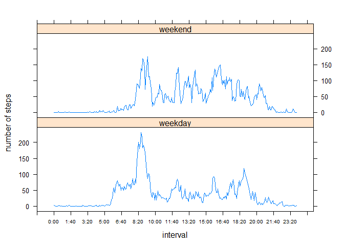

# Reproducible Research: Peer Assessment 1 (repdata-013)
Rick Gilbert  

### Introduction
This paper  will explore data from a personal activity monitoring device. This device collects data at 5 minute intervals through out the day. The data consists of two months of data from an anonymous individual collected during the months of October and November, 2012 and include the number of steps taken in 5 minute intervals each day.    

### Loading and preprocessing data set
  
Dataset for this course is located on the course website:  
[Activity Monitoring Data](https://d396qusza40orc.cloudfront.net/repdata%2Fdata%2Factivity.zip)


```r
# Download and/or extract
# First check for existence of data file or zipped archive. Unzip existing
# archive or download and unzip archive if necessary. Files are downloaded 
# to working directory.
urlSource <- "http://d396qusza40orc.cloudfront.net/repdata%2Fdata%2Factivity.zip"
zipFile <- "repdata_data_activity.zip"
dataFile <-"activity.csv"

if(!file.exists(dataFile)) {
        if(!file.exists(zipFile)) {
                download.file(
                           url = urlSource,
                        destfile = zipFile, mode="wb")
        }
        unzip(zipFile)
}

## Read in the data set
df <- read.csv(dataFile,header=TRUE,sep=",",stringsAsFactors = FALSE)
## Strip out NA records per instructions to ignore NA
df <- subset(df,!is.na(df$steps),1:3)
## Convert data string to R date
df$date <- as.Date(df$date,"%Y-%m-%d")
```

### Mean steps per day


```r
pkgLoad <- function(x)  # a utility function to load an R package, 
                        # downloading and installing it if necessary.
  {
    if (!require(x,character.only = TRUE))
    {
      install.packages(x,dep=TRUE, repos='http://cran.cnr.berkeley.edu/')
      if(!require(x,character.only = TRUE)) stop("Package not found")
    }
    # now load library and suppress warnings
    # suppressPackageStartupMessages(library(x))
    # library(x)
}
pkgLoad("dplyr")
```

```
## Loading required package: dplyr
## 
## Attaching package: 'dplyr'
## 
## The following object is masked from 'package:stats':
## 
##     filter
## 
## The following objects are masked from 'package:base':
## 
##     intersect, setdiff, setequal, union
```

```r
pkgLoad("lubridate")
```

```
## Loading required package: lubridate
```

```r
pkgLoad("lattice")
```

```
## Loading required package: lattice
```

```r
dfByDate <- df %>% group_by(date) %>% 
        summarize( sum = sum(steps))
names(dfByDate) <- c("date", "totalSteps")
meanDailySteps <- mean(dfByDate$totalSteps)
medianDailySteps <- median(dfByDate$totalSteps)

## Next, the histogram, using the Freedman-Diaconis rule.
## The bin-width is set to h=2bIQRbnb1/3, so # bins = (max-min)/h.
hist(dfByDate$totalSteps,
     breaks = "FD",
     col = "salmon",
     main = "Histogram of Total Steps per Day",
     xlab = "Total Steps")
        abline(v=meanDailySteps,lty=1,lwd=8, col = "green")
        abline(v=medianDailySteps,lty = 3, col = "brown", lwd = 3)
        text(100, 14, paste("Mean (solid) =",round(meanDailySteps, 1),
                            "\nMedian (dashed) =",round(medianDailySteps,0)),
             pos = 4)
```

 


### Average daily pattern


```r
dfDaily <- df %>% group_by(interval) %>% summarize( avgSteps = mean(steps))
## But we need the interval converted to time for proper charting, so
dfDaily$time <- strptime(sprintf("%04d",dfDaily$interval),format="%H%M")
## And, we compute the maxSteps value and the inerval when it occurs
maxInterval <- subset(dfDaily,avgSteps==max(avgSteps),c(time,avgSteps))
maxSteps <- round(maxInterval$avgSteps,1)
timeMaxSteps <-paste(sprintf("%02d",hour(maxInterval$time)),
                   sprintf("%02d",minute(maxInterval$time)),sep="")

plot(dfDaily$time,dfDaily$avgSteps,
        type = "l",
        xlab = "Time",
        ylab = "Average Step Count",
        main = "Step Count by Time of Day")
        points(maxInterval$time,maxInterval$avgSteps, 
               col="red",pch = 21,cex = 2,lwd = 3)
        text(maxInterval$time + minutes(30),maxInterval$avgSteps-15,
             paste("Max Avg Step Count of ",
                   round(maxInterval$avgSteps, 1),
                   "\n occurs at ",
                   timeMaxSteps),
             pos = 4)
```

 
  
- The interval with the highest step count average over a day begins at
0835 at a value of 206.2.  

### Imputing missing values
#### Strategy discussion
One cannot simply choose any value to replace a missing value. There should 
be some rationale underlying the value(s) chosen. The number of missing 
values and the pattern of missing values within the dataset, as well as the
questions to be addressed with the data need to be considered in choosing 
how to proceed.  

For example, if a single value is missing, one might choose the average of 
the prior and successive values. These are 5-minute "snapshots" of 
activity, and a transition from one level to another is not an unreasonable
assumption. But extend that logic to a string of 4 or 5 missing values and that
position of averaging prior and successive values is no longer tenable.  

Another possible choice is to replace missing value with the average for the
corresponding interval on all days when the value is not missing, for example,
If a value is missing for 0835 on 2007-10-12, and the average of the
non-missing values for 0835 on all other days is 56, then replace the missing
value at 0835 on 2007-10-12 with a value of 56. This approach assumes that any
missing interval is like the average of the same interval over all days, without
regard for:   
  
1 activity in a prior or succeeding interval 
2 differences attributable to day of week or day of month
3 any trend differences over time

But what about the case when whole days of data are missing? Is day of the
week a significant factor for steps? If so, one might replace the missing
values with the average for the corresponding intervals on the corresponding
days of the week. With this approach, there are similar concerns regarding
trends or day of the month.


#### Analysis  
So... in our case, what is the pattern of missing values? I need to reload
the original data, since I purged the NA's in an early step. I'll change 
the date strings to dates.


```r
df2 <- read.csv(dataFile,
                header=TRUE,
                sep=",",
                stringsAsFactors = FALSE,
                na.strings="NA")
df2 <- tbl_df(df2)
df2$date <- as.Date(df2$date,"%Y-%m-%d")
```
Now let's look at patterns of missing values. First I extract the 
incomplete cases from the data and look for a pattern.


```r
df3 <- df2[!complete.cases(df2),]
df3ByDate <- df3 %>% count(date)
missDateCount <- nrow(df3ByDate)
df3ByDate
```

```
## Source: local data frame [8 x 2]
## 
##         date   n
## 1 2012-10-01 288
## 2 2012-10-08 288
## 3 2012-11-01 288
## 4 2012-11-04 288
## 5 2012-11-09 288
## 6 2012-11-10 288
## 7 2012-11-14 288
## 8 2012-11-30 288
```
OK, there are 8 days with missing data, and each day is 
missing step values for all 288 intervals. So we have the case of whole days
and only whole days having missing data. Possible imputation options are
  
1) avg for the interval over all days
2) avg for the interval for all days that are the same day of the week
3) avg for the interval for all days that are the same day of the month
4) one of the above plus a bias for any observed trend over time.
  
Dealing with #4 is something I don't want to do in this exercise, and #3 
has the possibility of lacking data for the same day in both months, since
there are only two months of data.  Option #1 would be the easier of the
remaining two, but I want to play with option #2. To do that, we need avg
steps per day for each interval by day of the week. So then we need to extract 
day of week (dow) from the date values and compute the proper averages. Then
we can merge the averages with the base set. Finally, we replace NA's in the 
base with values from the average column. I know there's a better way to do
this, but I don't know the syntax for it at the moment.


```r
df2$dow <- wday(df2$date)
dfDow <- df2[!is.na(df2$steps),1:4] %>% group_by(dow,interval) %>% summarize( avgSteps = round(mean(steps),1))
df5 <- (merge(df2,dfDow,by = c("dow","interval"),all.x=TRUE))
df5 <- arrange(df5,date,interval)  # because MERGE changes the order
df5$steps[is.na(df5$steps)] <- df5$avgSteps
```

```
## Warning in df5$steps[is.na(df5$steps)] <- df5$avgSteps: number of items to
## replace is not a multiple of replacement length
```

```r
df5 <- subset(df5,,c("date","dow","interval","steps")) 
```


```r
Table2 <- df5[df5$interval==1835,1:4]
head(Table2,12)
```

```
##            date dow interval steps
## 224  2012-10-01   2     1835  92.3
## 512  2012-10-02   3     1835   0.0
## 800  2012-10-03   4     1835  26.0
## 1088 2012-10-04   5     1835   0.0
## 1376 2012-10-05   6     1835  69.0
## 1664 2012-10-06   7     1835 437.0
## 1952 2012-10-07   1     1835  80.0
## 2240 2012-10-08   2     1835  84.7
## 2528 2012-10-09   3     1835  61.0
## 2816 2012-10-10   4     1835  63.0
## 3104 2012-10-11   5     1835  22.0
## 3392 2012-10-12   6     1835 506.0
```
The table extract above shows imputed values for records 1 and 8 from
2012-10-1 and 2013-10-08. The single decimal place was retained in the
averages to make the imputed values easier to spot.

Now to build the data set for the histogram using the modified data set.

```r
dfByDate5 <- df5 %>% group_by(date) %>% 
        summarize( sum = sum(steps))
names(dfByDate5) <- c("date", "totalSteps")
meanDailySteps5 <- mean(dfByDate5$totalSteps)
medianDailySteps5 <- median(dfByDate5$totalSteps)

## Next, the histogram, using the Freedman-Diaconis rule.
## The bin-width is set to h=2bIQRbnb1/3, so # bins = (max-min)/h.
hist(dfByDate5$totalSteps,
     breaks = "FD",
     col = "lightskyblue",
     main = "Histogram of Total Steps per Day \n(inluding imputed values)",
     xlab = "Total Steps")
        abline(v=meanDailySteps5,lty=1,lwd=8, col = "green")
        abline(v=medianDailySteps5,lty = 3, col = "brown", lwd = 3)
        text(100, 14, paste("Mean (solid) =",round(meanDailySteps5, 1),
                            "\nMedian (dashed) =",round(medianDailySteps5,0)),
             pos = 4)
```

 
  
##### OK, shapewise it's a close call.  Let's see the earlier histogram again...

```r
hist(dfByDate$totalSteps,
     breaks = "FD",
     col = "salmon",
     main = "Histogram of Total Steps per Day \n(missing values excluded)",
     xlab = "Total Steps")
        abline(v=meanDailySteps,lty=1,lwd=8, col = "green")
        abline(v=medianDailySteps,lty = 3, col = "brown", lwd = 3)
        text(100, 14, paste("Mean (solid) =",round(meanDailySteps, 1),
                            "\nMedian (dashed) =",round(medianDailySteps,0)),
             pos = 4)
```

 
  
#### Conclusions about imputed data.
The median value was unaffected by the inclusion of the imputed values, and 
the change in the mean is insigficant at less than 1 part in 10,000.  The
histogram is generally the same shape, but the bins on either side of the 
peak bin are higher, which is reasonable, since we populated the missing 
value cells with mean values.  
  

### Are there differences in activity patterns between weekdays and weekends?
We already have day of the week in the df5 set, so we can build the required
variable to distinguish weekend from weekday. The weekday function has a
Sunday = 1 convention, so we'll classify 1 and 7 as weekend and 2-6 as weekday.


```r
df5$dayType[df5$dow %in% c(1,7)] <- "weekend"
df5$dayType[df5$dow %in% c(2:6)] <- "weekday"
df5$dayType <- as.factor(df5$dayType)
dfDaily2 <- df5 %>% group_by(dayType,interval) %>% summarize( avgSteps = mean(steps))
## But we need the interval converted to time for proper charting, so let's turn it into a factor
## dfDaily2$interval <- as.factor(dfDaily2$interval)
dfDaily2$time <- strptime(sprintf("%04d",dfDaily2$interval),format="%H%M")
timeOffset <- as.numeric(dfDaily2$time[1])
dfDaily2$timex = (as.numeric(dfDaily2$time) - timeOffset)/60
## The following is a little trickery to get h:mm labels for the X-axis
xlabl <-seq(-200,1500,100)
xlabl <- paste(xlabl %/% 60
               ,sprintf("%02i",xlabl %% 60),sep=":")
xlabl[1:2]<- c(" "," ")
xlabl[18]<-c(" ")
```
And now we need a panel plot of the two types days...


```r
xyplot(avgSteps ~ timex | dayType
       ,data=dfDaily2
       ,type="l"
       ,scales = list(x = list(tick.number=20, labels = xlabl, cex=0.6),
                      y = list(tick.number = 4)) ## , labels = time), 
       ,xlab="interval"
       ,ylab="number of steps"
       ##,axis(1, at = xval, labels = xlabl)
       ,layout=c(1,2))
```

 
  
#### Results
There is an apparent difference in the activity profiles between weekend
days and weekdays. Both charts have similar peak periods in the range
from 8:00 to 9:30, but weekday activity begins earlier in the day 
(about 5:30) and is almost ended by 20:00. In contrast, weekend activity
levels don't rise until about 07:00 and end around 21:30.
  
Activity after the peak morning period appears generally higher on the
weekend than it is on the average weekday.
